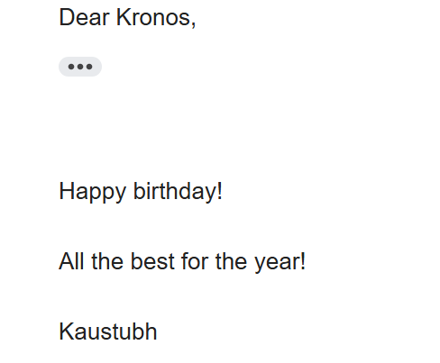

📩Email sending(Birthday wishing edition) | Day 32- 100 Days of Python

## A Python program to automate birthday emails using CSV data. Never forget a birthday again!

### **What It Teaches**
 - How to use `smtplib` to establish necessary server connections.
 - How to use `truncate()` to remove original content from file
 - How to use `seek()` to position cursor at the start of the file
 - The collective process of connecting and sending emails from one account to another
### ❓**How Is It Run**

1. Open a terminal  
2. Navigate to the project folder:
   ```bash
   cd 100DaysOfPython_Kaustubh/"Intro to Turtle Graphics"
   python random_walk.py  
   python hirst_painting.py 
   python shapes.py
   python spirograph.py
   ```
3. You can also run the code in an IDLE such as Visual Studio Code or PyCharm
### 💻 **Sample Output**



### 🙏 **Credits**
This project is part of my journey through the 
[100 Days of Code: Python Bootcamp](https://www.udemy.com/course/100-days-of-code/) by Dr. Angela Yu.  

The project idea comes from the course, but the code and documentation here are my own work.  
At times I referenced the course material when stuck, and in some cases my solution may look very similar to the course’s — simply because there are only a few straightforward ways to solve certain beginner problems.  
Either way, the implementation reflects my own understanding and learning process.