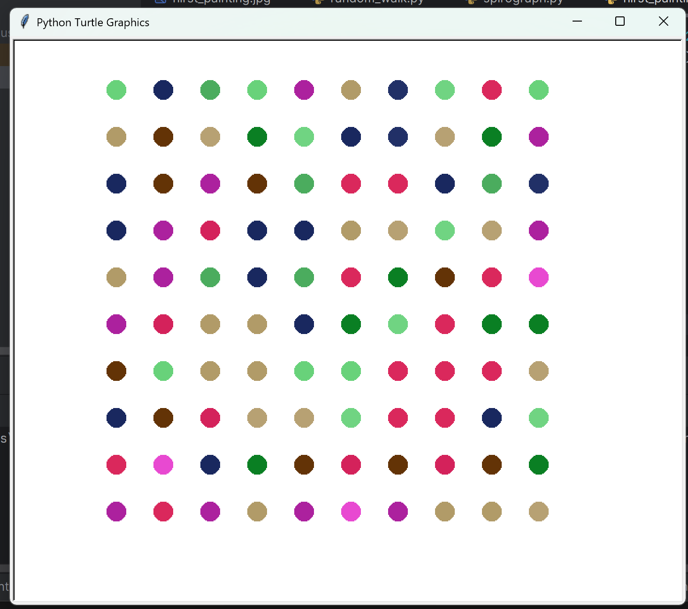

 🐢Intro to Turtle Graphics | Day 18- 100 Days of Python

## A group of introductory Turtle projects in Python, ranging from random walks to Hirst painting.

### **What It Teaches**
 - How to apply colors using RGB values(R for red, G for green, B for blue) instead of named-colors.
 - How to create objects from the `Turtle` class.
 - How to make Turtle object change directions, move forward, speed up, and change colors.
### ❓**How Is It Run**

1. Open a terminal  
2. Navigate to the project folder:
   ```bash
   cd 100DaysOfPython_Kaustubh/"Intro to Turtle Graphics"
   python random_walk.py  
   python hirst_painting.py 
   python shapes.py
   python spirograph.py
   ```
3. You can also run the code in an IDLE such as Visual Studio Code or PyCharm
### 💻 **Sample Output**



### 🙏 **Credits**
This project is part of my journey through the 
[100 Days of Code: Python Bootcamp](https://www.udemy.com/course/100-days-of-code/) by Dr. Angela Yu.  

The project idea comes from the course, but the code and documentation here are my own work.  
At times I referenced the course material when stuck, and in some cases my solution may look very similar to the course’s — simply because there are only a few straightforward ways to solve certain beginner problems.  
Either way, the implementation reflects my own understanding and learning process.